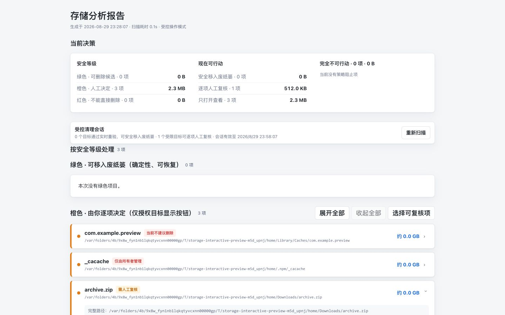

# OpenCleaner

OpenCleaner is a macOS-only storage analysis Skill for Codex and other AI
agents. It performs read-only disk analysis, explains green/yellow/red risk
tiers, and offers only recoverable Trash operations authorized by deterministic
rules and a short-lived local session.

## Why OpenCleaner

OpenCleaner is for people who want to understand a disk before deciding what
to do with it. It separates scan facts, deterministic rules, and recoverable
actions instead of treating every directory named “cache” as disposable.

| Concern | OpenCleaner |
| --- | --- |
| Safety | Read-only by default; permitted disposal only moves items to Trash. |
| Transparency | Green/yellow/red tiers include reasons, paths, exclusions, and recovery guidance. |
| Agent boundary | An agent can explain a finding but cannot grant deletion permission to an unknown path. |



## Quick start

```bash
git clone https://github.com/JayHome137/OpenCleaner-skills.git
cd OpenCleaner-skills/open-cleaner
python3 scripts/scan.py --progress > /tmp/open-cleaner-scan.json
python3 scripts/classify.py /tmp/open-cleaner-scan.json /tmp/open-cleaner-analysis.json
python3 scripts/validate_plan.py /tmp/open-cleaner-analysis.json > /tmp/open-cleaner-plan.json
python3 scripts/summarize.py /tmp/open-cleaner-analysis.json /tmp/open-cleaner-plan.json
```

The first four commands are read-only and produce a Dry Run. Start the local
interactive report only after reviewing the summary:

```bash
python3 scripts/server.py /tmp/open-cleaner-analysis.json
```

Green means a deterministic rule may move an item to Trash; yellow requires a
separate human review; red is display-only. OpenCleaner never permanently
deletes files and never asks for administrator privileges.

### Optional local authorization modes

The `main` branch uses `token` mode by default. It prevents accidental
cross-origin requests, but it is not an operating-system process boundary: a
different process running as the same macOS user may still read the local page
or token and replay an authorized action.

The experimental [`codex/local-auth-modes`](https://github.com/JayHome137/OpenCleaner-skills/tree/codex/local-auth-modes)
branch is kept as a separate, non-merged architecture choice:

| Mode | What changes | Intended use |
| --- | --- | --- |
| `token` | Page token, plan ID, and action ID checks | Trusted personal device |
| `system-confirm` | Visible macOS confirmation before each Trash batch | Reduce silent local replay |
| `view-only` | No action IDs or mutation endpoints | Shared device or evidence review |

The branch is not part of the default Release and does not provide true OS
process authentication. See its [full threat-boundary notes](https://github.com/JayHome137/OpenCleaner-skills/blob/codex/local-auth-modes/docs/LOCAL_AUTHORIZATION_MODES.md).

See [SECURITY.md](SECURITY.md), [CONTRIBUTING.md](CONTRIBUTING.md), and the
[Chinese README](README.md) for the full scope and development workflow.

The [release checklist](docs/RELEASE_CHECKLIST.md) documents the reproducible
validation, archive, checksum, and attestation gates.

The repository is public. Use [Discussions](https://github.com/JayHome137/OpenCleaner-skills/discussions)
for usage questions and follow [CONTRIBUTING.md](CONTRIBUTING.md) before
opening a pull request.

OpenCleaner 1.2.0 and later are licensed under the
[Apache License 2.0](LICENSE). Third-party notices remain in
[THIRD_PARTY_NOTICES.md](THIRD_PARTY_NOTICES.md).

Official releases include `SHA256SUMS` and GitHub Artifact Attestations:

```bash
shasum -a 256 --check SHA256SUMS
gh attestation verify OpenCleaner-1.2.0.tar.gz \
  --repo JayHome137/OpenCleaner-skills
```
