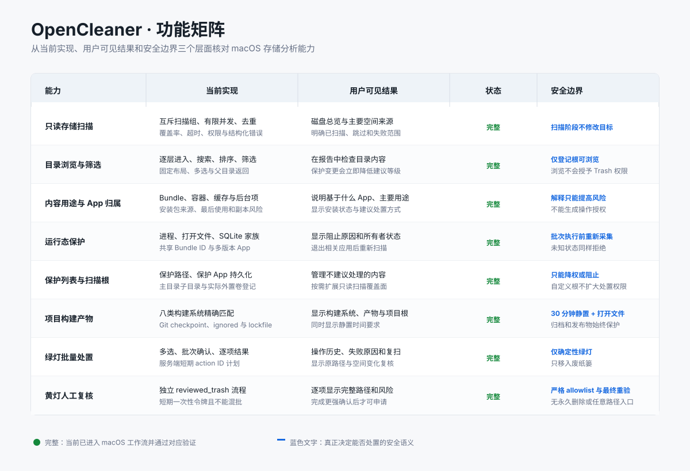

# OpenCleaner

面向 Codex 和其他 AI Agent 的 macOS 存储分析 Skill：只读扫描磁盘占用，生成中文分级报告，并通过确定性规则提供受控、可恢复的文件处置。

[](https://github.com/JayHome137/OpenCleaner-skills/actions/workflows/macos-validation.yml)
[](LICENSE)

## 核心能力

- **macOS 存储分析**：识别磁盘热点、大目录、开发缓存、离线内容和应用数据，并明确覆盖可信度与 APFS 空间释放延迟。
- **确定性分级**：规则引擎先生成绿、黄、红三级草稿，Agent 只能补充解释或提高风险，不能新增文件操作权限。
- **中文交互报告**：同时展示扫描发现、当前可行动和当前被阻止的决策摘要，按 App/所有者聚合前 8 组；完整明细、证据、安装包专项视图、权限遗漏和风险说明保留在 HTML 下钻区域。
- **App 归属与运行态保护**：解析 Bundle ID、显示名称、容器、缓存、Application Support、登录项和后台项；SQLite WAL/SHM、打开文件、共享 Bundle ID、多版本 App、活动进程或未知状态都会阻止处置。
- **本地保护与扫描根**：持久保护路径或 App，并登记主目录或 `/Volumes` 当前挂载卷中的自定义只读扫描根；两者都不能授予新的删除权限。
- **分级安全处置**：普通 Trash 当前不对所有者工具管理的内容开放；下载或临时目录的黄灯直接子项必须经过独立人工复核、短时一次性令牌和更强确认。npm、pnpm、Gradle、Go、Codex、Claude、Xcode DerivedData 等所有者工具目标只展示说明和命令，不开放删除入口。
- **可重复使用**：只读容量测量支持短 TTL、指纹失效的私有缓存；扫描支持 stderr 进度，取消不会发布半成品。
- **项目产物阶段**：按需发现 allowlist 内的构建/测试生成目录；只有项目清单、Git 状态、静置期和打开文件检查全部通过才进入黄灯复核。
- **操作可审计**：记录操作结果、失败原因、目标复核和磁盘可用空间变化。

OpenCleaner 不提供永久删除、系统目录自动清理、管理员权限操作、完整应用卸载、系统优化或实时硬件监控。

## 功能矩阵



矩阵中的“完整”表示该能力已经进入当前 macOS 工作流并通过对应验证；它不代表绕过确认或扩大处置权限。平台范围和验证边界见下文。

## 快速开始

### 安装 Skill

```bash
git clone https://github.com/JayHome137/OpenCleaner-skills.git
mkdir -p "${CODEX_HOME:-$HOME/.codex}/skills"
cp -R OpenCleaner-skills/open-cleaner "${CODEX_HOME:-$HOME/.codex}/skills/"
```

重新打开 Codex 后，使用机器名 `$open-cleaner` 调用：

```text
使用 $open-cleaner 分析电脑存储空间并生成分级报告。
```

### 手动运行

以下命令从 Skill 根目录执行：

```bash
cd open-cleaner
python3 scripts/scan.py --progress > /tmp/storage-scan.json
python3 scripts/classify.py /tmp/storage-scan.json /tmp/storage-analysis.json
python3 scripts/validate_plan.py /tmp/storage-analysis.json > /tmp/storage-dry-run.json
python3 scripts/summarize.py /tmp/storage-analysis.json /tmp/storage-dry-run.json
python3 scripts/server.py /tmp/storage-analysis.json
```

本地服务绑定 `127.0.0.1` 的随机端口，并使用随机 token。浏览器只提交 action ID；黄灯复核额外提交服务端签发的一次性令牌，不提交路径或操作类型。

项目开发阶段已经完成测试/构建、源码已有可恢复检查点且相关进程已退出时，可以改用项目阶段分析：

```bash
python3 scripts/project_stage.py > /tmp/open-cleaner-project-stage.json
python3 scripts/validate_plan.py /tmp/open-cleaner-project-stage.json > /tmp/open-cleaner-project-stage-plan.json
python3 scripts/server.py /tmp/open-cleaner-project-stage.json
```

该阶段最多展示 200 个大于阈值的 allowlist 生成目录。`node_modules` 和 Rust `target` 只有在构建系统匹配、依赖锁文件存在且全部阶段门通过时才可进入黄灯复核；源码、锁文件、虚拟环境、归档、签名产物和发布包不会进入处置计划。

只需要可分享的只读报告时：

```bash
python3 scripts/build_report.py /tmp/storage-analysis.json ~/Desktop/storage-report.html
```

该 HTML 是最终的只读结果入口：它包含决策摘要、证据和完整明细，但不会显示文件处置按钮；只有上面的本地受控服务会根据当前 session plan 显示可操作入口。

需要比较两次分析时，可运行 `python3 scripts/compare_reports.py <previous-analysis.json> <current-analysis.json>` 查看按风险级别和总量的容量变化；对比结果只读，不会产生处置动作。

## 安全设计

- 扫描阶段严格只读，不修改被扫描目录。
- Agent 不能把未知路径提升为可执行目标。
- Dry Run 不可执行；受控操作由服务端重新生成 30 分钟有效的 session plan。
- 执行前重新检查真实路径、文件身份、父目录、符号链接、保护目录和匹配规则。
- 自定义扫描根只扩大只读可见范围；浏览器提交的路径不会进入 action plan，也不会获得 Trash 权限。
- 持久保护列表只能将目标降权并阻止处置；设置文件使用私有权限和原子替换。
- SQLite WAL/SHM、打开文件、共享 Bundle ID 和多版本 App 在服务端策略层重新检查。
- 已知所有者工具的运行状态必须是 `inactive`；`active` 或 `unknown` 都会失败关闭，执行前再次检查。
- Trash 失败即停止，不回退到 `rm`、`os.remove` 或其他永久删除方式。
- 所有者工具管理的目标仅作为解释卡片出现；命令是复核建议，OpenCleaner 不会代执行，也不会把它们加入 Trash action。
- 批量操作在第一个副作用前完成全部目标复核，已完成的 Trash 动作不能重放。
- 普通 `trash` 仅限绿灯；`reviewed_trash` 仅限黄灯下载/临时直接子项或严格验证的项目生成目录。复核令牌有效 120 秒、只用一次，且与计划和完整 action ID 集绑定。
- Trash 返回成功后仍会确认原路径已经移走，并写入本地操作日志。

## 工作原理

```text
只读扫描（进度 + 私有容量缓存）
  -> 版本化 scan-result
  -> 确定性规则分类
  -> Agent 补充语义解释
  -> App 归属与安装包元数据
  -> 不可执行 Dry Run
  -> 聊天决策摘要（与 HTML 同时交付）
  -> 短期 session action plan
  -> HTML 目录浏览、保护列表、多选、批次确认与运行态提示
  -> 黄灯独立复核令牌（仅适用受限目标）
  -> 打开目录或移到废纸篓
  -> 操作日志、逐项结果与重新扫描
```

数据契约位于 [`open-cleaner/schemas/`](open-cleaner/schemas/)，安全规则位于 [`open-cleaner/rules/`](open-cleaner/rules/)。扫描、策略、报告和执行模块保持单向职责，报告不能绕过服务端授权。

## 平台支持

| 平台 | 状态 | 说明 |
| --- | --- | --- |
| macOS | 已验证 | 当前工作树的扫描、规则、报告、安全回归和临时 fixture Trash smoke 已在本地通过；既有版本曾通过 GitHub runner。 |
| Windows | 当前关闭 | 实验实现和 smoke 测试保留，公开扫描、分类、计划与文件操作入口均失败关闭，待独立测试后再决定恢复。 |
| Linux | 不支持 | 扫描器和文件操作明确拒绝。 |

运行时只依赖 Python 3 标准库和 macOS 系统自带文件管理能力。

## 验证

```bash
python3 scripts/validate_package.py
python3 -m unittest discover -s tests -p 'test_*.py' -v
python3 scripts/benchmark_scan.py
```

- [验收矩阵](docs/ACCEPTANCE_MATRIX.md)：本地与 GitHub runner 证据、验证边界和当前状态。
- [项目目标](PROJECT_GOALS.md)：产品范围、安全不变量和实现阶段。
- [来源记录](docs/PROVENANCE.md)：逐文件来源与独立重写说明。

## 许可证

项目许可见 [LICENSE](LICENSE)，商业授权入口见 [COMMERCIAL_LICENSE.md](COMMERCIAL_LICENSE.md)，第三方来源与历史授权见 [THIRD_PARTY_NOTICES.md](THIRD_PARTY_NOTICES.md)。
